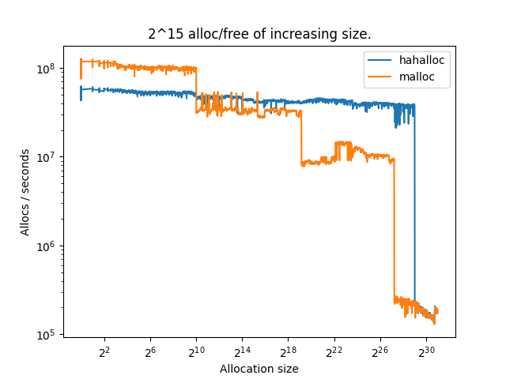
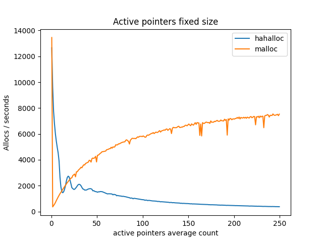

# Hahalloc

A lightweight, memory allocator written in C, that can sometimes be faster than malloc.

## Definitions
 - range
 - root
 - metadata

## example

# Optimisations
 - range size segmentation
 - fast reallocation of freed memory
 - reduced fragmentation
   - merging neighbooring free ranges
 - range page allignment
 - small range metadata size (idk if really present)

# Benchmarking

$2^{15}$ allocs of increasing sizes.

$2^{5}$ allocs of increasing sizes.

$2^{20}$ random allocs and free of 1MiB, while keeping a buffer of x/2 pointers.

$2^{20}$ random allocs and free of random sizes, while keeping a buffer of x/2 pointers.

reallocs

