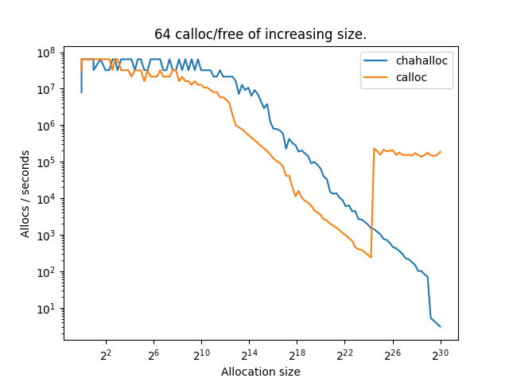

# Hahalloc

A lightweight, thread-safe* memory allocator written in C, that can sometimes be faster than malloc. It is designed to track memory leaks and gives you a heap summary at the end of your program's execution.

The API is the following:

| Hahalloc | STD equivalent | 
|---|--- |
| hahalloc | malloc |
| frhehe | free |
| chahalloc | calloc |
| rehehalloc | realloc |
| mem_lhihiks | |
### API reference

```C
void *hahalloc(size_t size);
```
Behaves the exact same way as `malloc`: returns a pointer of `size` bytes.

```C
void frhehe(void *ptr);
```
Same as `free`, liberates the pointer's memory. Further use of `ptr` might result in an immidiate crash, it should be set to `NULL`.

```C
void *rehehalloc(void *ptr, size_t size);
```
Once again this behaves like it's STD's counterpart, with the difference that `size` can be smaller than the allocated size of `ptr`. A pointer to the newly-allocated memory is returned.

```C
void *chahalloc(size_t size);
```
`calloc` equivalent. Note that the arguments differ as `chahalloc` only takes a `size` argument to be more fitting with `hahalloc`.

```C
void mem_lhihiks(size_t size);
```
You can call this function at any time to print a heap summary to `stdout`.

# Using Hahalloc
To compile the library, simply clone the repo and run `make`.
To run tests and / or performance benchmark, run `make tests`, `make bench` or `make all`.
To link this library to another program, run it with: 
```bash
LD_LIBRARY_PATH=<path_to_libhahaloc.so>:$LD_LIBRARY_PATH
```

# Inner workings

This repo is an assignment for the first year of my master's degree in high performance computing. As i could have followed some tutorials on implementing memory allocators, i decided not to and went in pretty much blind. If some of the terminology or concepts explained here seem made up, that's why. 

### General definitions and explanation

The library is basically a big `mmap` and `munmap` wrapper.
Each call to `mmap` gives us a chunk of memory to work with, and each corresponding call to `munmap` releases it. Let's call these chunks **mappings**.

We could simply hand-off these mappings to the user but that would be pretty sub-optimal as there is a lot of overhead in asking memory to the OS. 
In fact, the mappings are over-allocated, and divided into parts that each act as an individual pointer sent to the user. Each part is called a **range**. Ranges are the base of the structure of Hahalloc.

### Data structure

In order to allow the allocation of *"infinite"* ranges, a double linked list is used. This list links every range to its neighboors (*"right"* and *"left"* neighboors as in directly before and after in memory) and across mappings.


Ranges and mappings can be represented as such:
```
├───────────────── mapping 1 ──────────────┤    ├───────────────── mapping 2 ──────────────┤ ...
├───── range 1 ────┤    ├───── range 2 ────┤    ├───── range 3 ────┤    ├───── range 4 ────┤
┏━━━━━━┳━━━━━━━━━━━┓    ┏━━━━━━┳━━━━━━━━━━━┓    ┏━━━━━━┳━━━━━━━━━━━┓    ┏━━━━━━┳━━━━━━━━━━━┓
┃ meta ┃ user data ┃ -> ┃ meta ┃ user data ┃ -> ┃ meta ┃ user data ┃ -> ┃ meta ┃ user data ┃ ...
┗━━━━━━┻━━━━━━━━━━━┛    ┗━━━━━━┻━━━━━━━━━━━┛    ┗━━━━━━┻━━━━━━━━━━━┛    ┗━━━━━━┻━━━━━━━━━━━┛
```
With this structure, we just have to store a pointer to the first range on the stack and we can let it expand itself as the user requests more memory.
However, for the sake of optimisation, there are a total of 22 ranges stored on the stack.
This allows allocations of similar sizes to stay close to eachother, preventing some fragmentation of the memory.
Ranges that are pointed to from the heap are called **root ranges** and have a special flag in their metadata.

Note that no memory is mapped if the user doesn't ask for it. This means that the static array of pointers-to-root-ranges is initially an array of `NULL`.

We can represent the total memory structure like so:
```
┏━━━━━━━━━┓    ┏━━━━━━━━━━━┓    ┏━━━━━━━━━━━┓
┃ ROOT  1 ┃ -> ┃ mapping 1 ┃ -> ┃ mapping 2 ┃ ...
┣━━━━━━━━━┫    ┗━━━━━━━━━━━┛    ┗━━━━━━━━━━━┛
┃ ROOT  2 ┃ -> NULL
┗━━━━━━━━━┛    
   ...
┏━━━━━━━━━┓    ┏━━━━━━━━━━━┓    ┏━━━━━━━━━━━┓
┃ ROOT 21 ┃ -> ┃ mapping 1 ┃ -> ┃ mapping 2 ┃ ...
┣━━━━━━━━━┫    ┣━━━━━━━━━━━┫    ┗━━━━━━━━━━━┛
┃ ROOT 22 ┃ -> ┃ mapping 1 ┃ -> NULL
┗━━━━━━━━━┛    ┗━━━━━━━━━━━┛
```
Better justification of this choice of structure can be found in the [Optimisation](#optimisation) section.

### Range struct

Range metadata is made up of 4 components:
```C
typedef struct range {
    struct range *prev;
    struct range *next;
    size_t size;
    unsigned short meta;
} range;
```

`prev` and `next` are obviously pointers to linked neighboors,
`size` is the number of bytes of the range, or the memory sent to the user
`meta` is a byte containing 4 bit flags:
```
00000000
    │││└─ range is the root of a list
    ││└── range is allocated
    │└─── range is the start of a mapping
    └──── oversize mapping
```
This would, in theory, optimise the size of a range and save some space with lots of active pointers, but is in fact not necessary because GCC adds padding to structs, making them 8-bytes aligned.
I guess another way to see it is that we still have 7 bytes free for use in the struct.

# Optimisations

Here is a list of optimisations implemented:

### Mapping recycling
Mapping are allocated to **10x** the size of the biggest range that fits in them. 
For example: mappings on root number 10 are $2^{10}\times 10$ bytes long and store ranges that are between $2^9$ and $2^{10}$ bytes.

### Root size groups

### Memory de-fragmentation

#### coalescence
#### innacessible range prevention

# Thread safety

# Performance

$2^{15}$ allocs of increasing sizes.


$2^{5}$ allocs of increasing sizes.


$2^{20}$ random allocs and free of 1MiB, while keeping a buffer of x/2 pointers.


$2^{20}$ random allocs and free of random sizes, while keeping a buffer of x/2 pointers.


reallocs


# Possible improvements